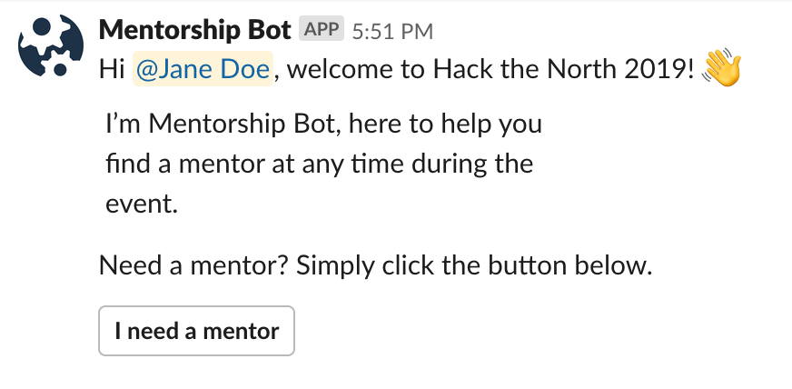
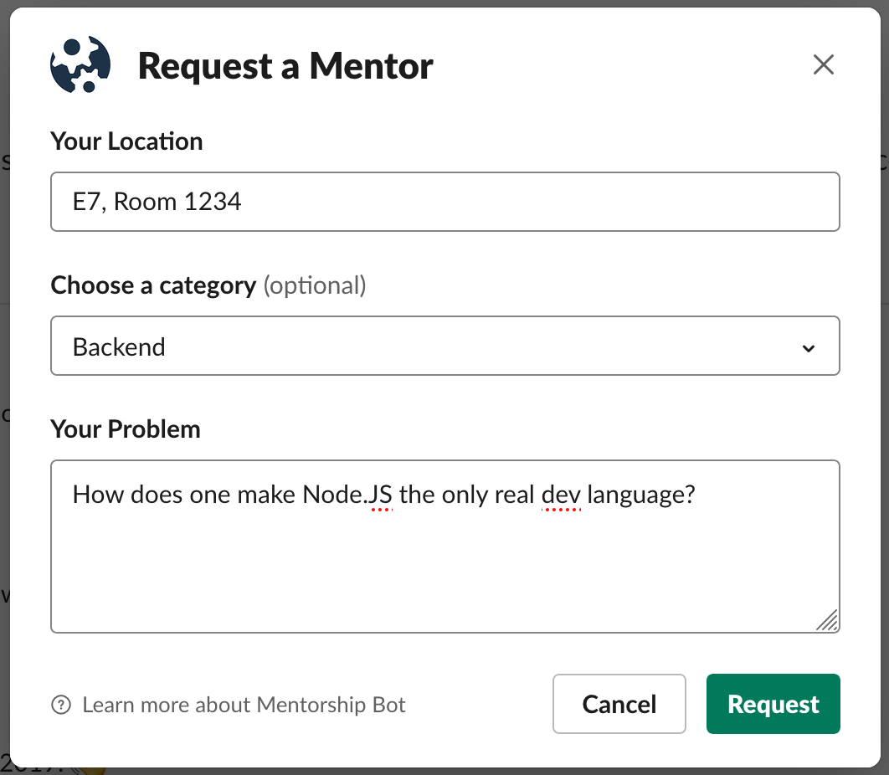
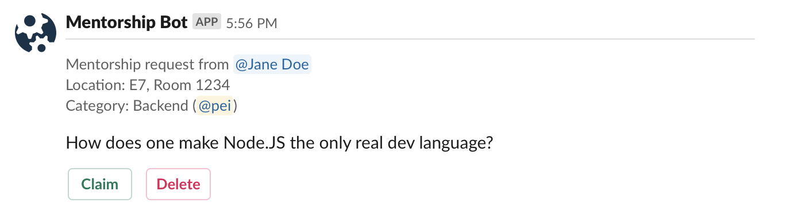
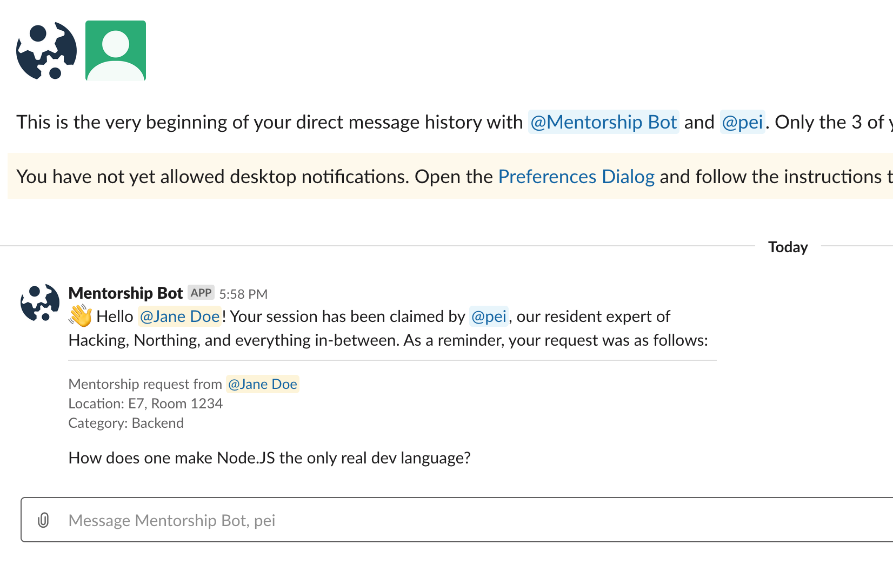
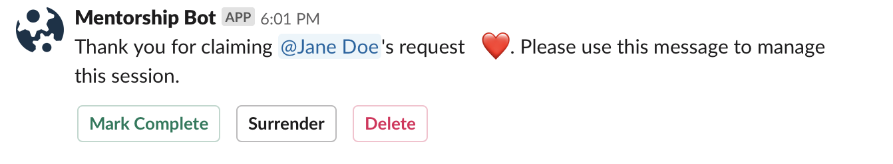
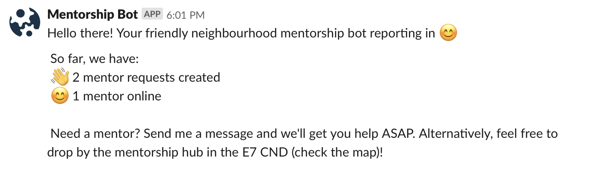
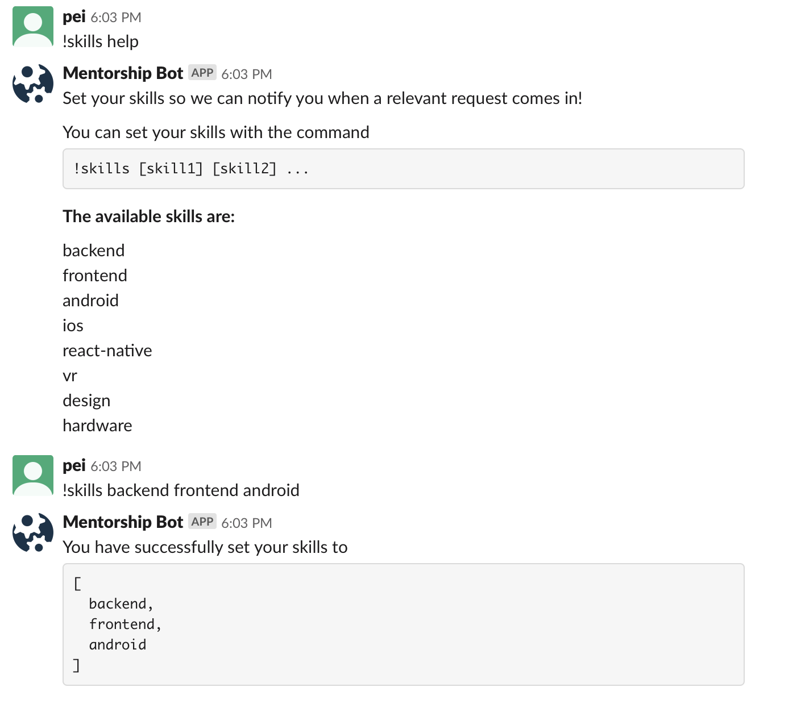
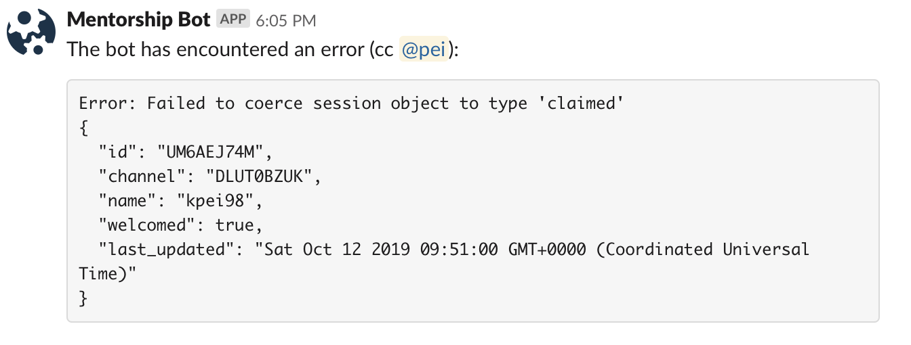

# Mentorship Slackbot

## General overview

### Workflow
Slackbot appears for all hackers, click button to ask for help. Bot asks for question.

1. Mentees interact with the BOT through DM.

Welcome Message | Request Popup     
:-:|:--:
 | 

2. The bot posts the request into the private channel of mentors. It will tag mentors with the relevant skill.

4. Mentor can claim the request, at which point a DM is created between the mentor, the requester, and the bot

5. The Mentor will receive controls via DM to close the request if it’s done, or surrender it back into the queue if they cannot do it

6. Bot pings a stats channel (e.g. #general) every 3 hours with updates and how to get in touch for help

7. Old, unclaimed requests are automatically bumped every 10 min if nobody has responded to it

### Skills
1. Mentors can set their skills with the bot through the `!skills` command in DM

### Errors
The bot will automatically report any runtime errors to the private mentors channel (tagging the mentor lead in the process!). 

## Tech Setup

### Data Store
This app is written in TypeScript and uses a local `lowdb` json database to store sessions. This json database file is automatically generated at runtime as [src/storage/db.json](src/storage/db.json). 

### Configuration
Configuration parameters are stored in [src/config/index.ts](src/config/index.ts). A sample configuration file is provided in this repo.

## Technologies/Acknowledgements

- [lowdb](https://github.com/typicode/lowdb) for local document storage
- [TypeScript](http://www.typescriptlang.org/)
- Deploy to Kubernetes
- [Node Slack SDK](https://slack.dev/node-slack-sdk/)

## Deployment
**This bot is deployed manually with `skaffold run`. It will not autodeploy from master**
When deploying make sure to manually delete the old deployment, otherwise the new one will forever wait for the volume claim
